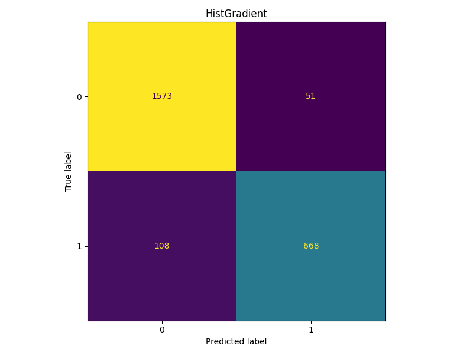
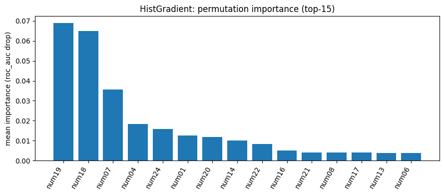

# HW06 – Report

> Файл: `homeworks/HW06/report.md`  
> Важно: не меняйте названия разделов (заголовков). Заполняйте текстом и/или вставляйте результаты.

## 1. Dataset

- Какой датасет выбран: `S06-hw-dataset-01.csv`
- Размер: 12000 строк 30 столбцов
- Целевая переменная: `target` 0 класс - 0.6765831%   1 класс - 0.323417%
- Признаки: все признаки в датасете числовые

## 2. Protocol

- Разбиение: train= 0.8% test = 0.2% random_state = 42
- Подбор: CV на train было 5 фолдов, оптимизация по roc_auc
- Метрики: accuracy, F1, ROC-AUC, precision, recall  данные метрики являются минимально необходимым набором для оценки качества сбалансированного датасета при бинарной классификации

## 3. Models

Было построено и сравнено 5 моделей с наилучшими гиперпараметрами из заданного диапозона, а именно:

- DummyClassifier (baseline) strategy='stratified'
- LogisticRegression был подобран параметр ругуляризации C = 1.0
- DecisionTreeClassifier 'ccp_alpha': 0.0, 'max_depth': None, 'min_samples_leaf': 20
- RandomForestClassifier 'max_depth': None, 'max_features': 'sqrt', 'min_samples_leaf': 1
- HistGradientBoosting 'learning_rate': 0.1, 'max_depth': None, 'max_leaf_nodes': 63

## 4. Results

- Таблица/список финальных метрик на test по всем моделям
accuracy	f1	precision	recall	roc_auc	model
4	0.933750	0.893645	0.929068	0.860825	0.914710	HistGradient
3	0.925833	0.879240	0.928367	0.835052	0.902132	RandomForest
2	0.869167	0.794233	0.808000	0.780928	0.846129	DecisionTree
1	0.827500	0.707627	0.782813	0.645619	0.780014	LogReg(scaled)
0	0.575417	0.340453	0.342003	0.338918	0.513671	Dummy(stratified)

- Как видно из таблицы наиболее лучший показатель по ROC-AUC является HistGradient за счет того, что HistGradient градиентный бустинг последовательно минимизирует ошибки и гистограммный подход оптимален для данного датасета, вывод: HistGradient объективно лучший алгоритм для задач с числовыми признаками и сложными зависимостями, что отражается в высокой ROC-AUC

## 5. Analysis

- Устойчивость: что будет, если поменять `random_state` (хотя бы 5 прогонов для 1-2 моделей) 
roc_auc для разных random_state в модели DecisionTreeClassifier
random_state = 1     'best_cv_roc_auc': 0.9191322694653016
random_state = 50    'best_cv_roc_auc': 0.9174883689794825
random_state = 1000  'best_cv_roc_auc': 0.9178683218479715
random_state = 12453 'best_cv_roc_auc': 0.9181895152842705
random_state = 1     'best_cv_roc_auc': 0.918518146623378

-confusion matrix для лучшей модели, из графика видно, что наша модель достаточно хорошо определяет правильноположительные классы 1573 и правильноотрицательные классы 668, ошибается же 51 раз на FN определяя объекты положительного класса как отрицательные и 108 раз на FP определяя отрицательные классы как положительные

- Интерпретация: permutation importance (top-10/15), из столбчатой диаграммы видно, что наиболее значимыми признаками при расчете roc-auc являются признаки, которые имеют importance num18 ≈ 0.065 и num19 ≈ 0.07, что в несколько раз больше чем у последующих, оказывая наибольшее влияние на предсказания модели, что свидетельствует об их высокой информативности для алгоритма.

## 6. Conclusion

Сравнивая несколько моделей для данного датасета, мы можем сделать вывод, что наиболее подходящий алгоритм для предсказаний является HistGradientBoostinigClassifier, он достаточно быстрый относительно RandomForestClassifier и гораздо эффективнее DecisionTreeClassifier. DecisionTreeClassifier хорошо использовать как часть для таких методов обучения как Boosting или Bagging, но не как самостоятельную модель, так как метод склонен к переобучению и показывает не самые лучшие результаты. RandomForestClassifier также прекрасный вариант, но выбор между ним и HistGradientBoostinigClassifier зависит от задач и целей, например RandomForestClassifier потребляет меньше памяти и быстрее на маленьких данных(до 100тыс. строк), хотя и показывает чуть меньше точности по сравнению с HistGradientBoostinigClassifier. Из всего выше сказанного, можно сделать вывод что "лучшей" модели не существует, всегда надо сравнивать их показания и анализировать их друг с другом, выбирая между точностью и эффективностью.