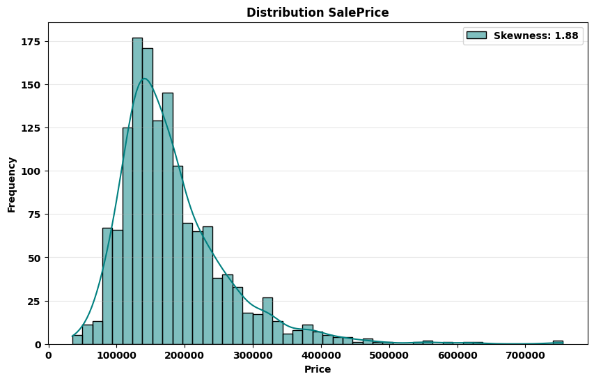
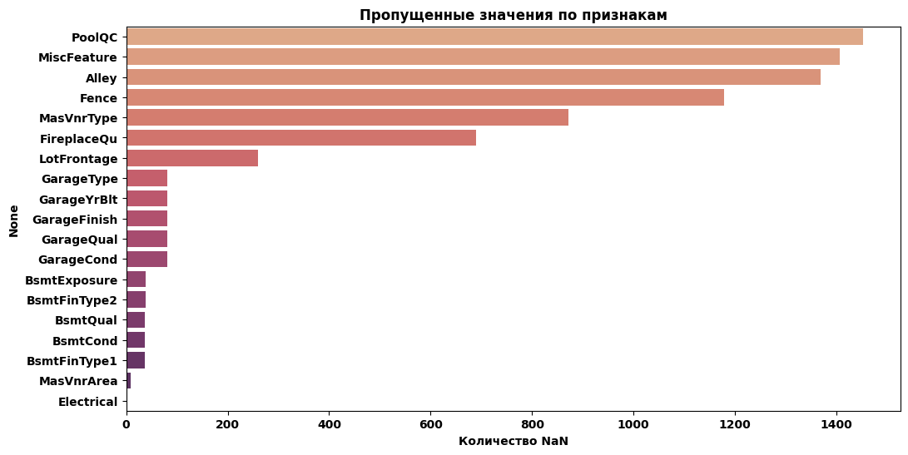
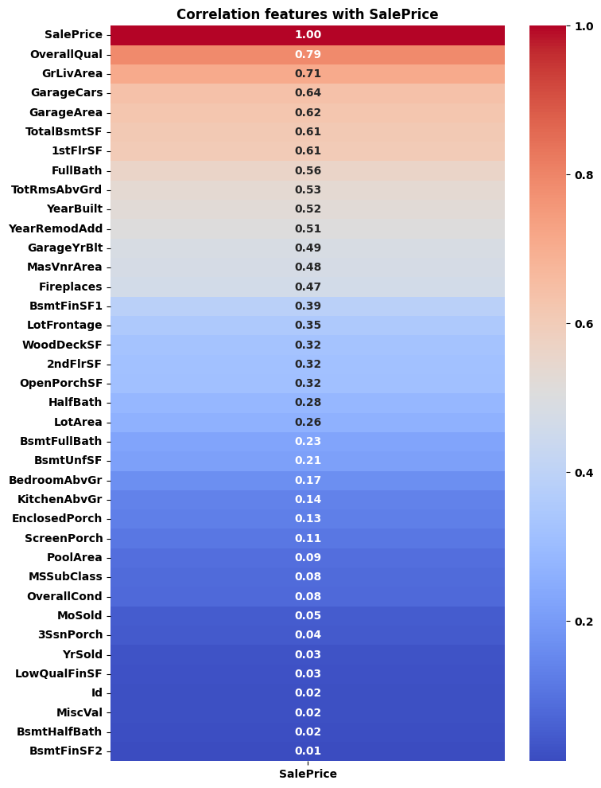
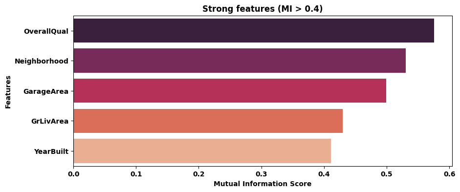

# EDA-отчёт: train.csv

Строк: **1460**, столбцов: **81**

## Качество данных

- Оценка качества: **0.93**
- Макс. доля пропусков в столбце: **99.52%**

- Слишком мало строк (<100): **Нет**
- Есть дубликаты ID: **Нет**

## Визуализации

## Обзор признаков

| Колонка | Тип | Пропуски (%) | Уникальных |
|---|---|---|---|
| Id | int64 | 0.0% | 1460 |
| MSSubClass | int64 | 0.0% | 15 |
| MSZoning | str | 0.0% | 5 |
| LotFrontage | float64 | 17.7% | 110 |
| LotArea | int64 | 0.0% | 1073 |
| Street | str | 0.0% | 2 |
| Alley | str | 93.8% | 2 |
| LotShape | str | 0.0% | 4 |
| LandContour | str | 0.0% | 4 |
| Utilities | str | 0.0% | 2 |
| LotConfig | str | 0.0% | 5 |
| LandSlope | str | 0.0% | 3 |
| Neighborhood | str | 0.0% | 25 |
| Condition1 | str | 0.0% | 9 |
| Condition2 | str | 0.0% | 8 |
| BldgType | str | 0.0% | 5 |
| HouseStyle | str | 0.0% | 8 |
| OverallQual | int64 | 0.0% | 10 |
| OverallCond | int64 | 0.0% | 9 |
| YearBuilt | int64 | 0.0% | 112 |
| YearRemodAdd | int64 | 0.0% | 61 |
| RoofStyle | str | 0.0% | 6 |
| RoofMatl | str | 0.0% | 8 |
| Exterior1st | str | 0.0% | 15 |
| Exterior2nd | str | 0.0% | 16 |
| MasVnrType | str | 59.7% | 3 |
| MasVnrArea | float64 | 0.5% | 327 |
| ExterQual | str | 0.0% | 4 |
| ExterCond | str | 0.0% | 5 |
| Foundation | str | 0.0% | 6 |
| BsmtQual | str | 2.5% | 4 |
| BsmtCond | str | 2.5% | 4 |
| BsmtExposure | str | 2.6% | 4 |
| BsmtFinType1 | str | 2.5% | 6 |
| BsmtFinSF1 | int64 | 0.0% | 637 |
| BsmtFinType2 | str | 2.6% | 6 |
| BsmtFinSF2 | int64 | 0.0% | 144 |
| BsmtUnfSF | int64 | 0.0% | 780 |
| TotalBsmtSF | int64 | 0.0% | 721 |
| Heating | str | 0.0% | 6 |
| HeatingQC | str | 0.0% | 5 |
| CentralAir | str | 0.0% | 2 |
| Electrical | str | 0.1% | 5 |
| 1stFlrSF | int64 | 0.0% | 753 |
| 2ndFlrSF | int64 | 0.0% | 417 |
| LowQualFinSF | int64 | 0.0% | 24 |
| GrLivArea | int64 | 0.0% | 861 |
| BsmtFullBath | int64 | 0.0% | 4 |
| BsmtHalfBath | int64 | 0.0% | 3 |
| FullBath | int64 | 0.0% | 4 |
| HalfBath | int64 | 0.0% | 3 |
| BedroomAbvGr | int64 | 0.0% | 8 |
| KitchenAbvGr | int64 | 0.0% | 4 |
| KitchenQual | str | 0.0% | 4 |
| TotRmsAbvGrd | int64 | 0.0% | 12 |
| Functional | str | 0.0% | 7 |
| Fireplaces | int64 | 0.0% | 4 |
| FireplaceQu | str | 47.3% | 5 |
| GarageType | str | 5.5% | 6 |
| GarageYrBlt | float64 | 5.5% | 97 |
| GarageFinish | str | 5.5% | 3 |
| GarageCars | int64 | 0.0% | 5 |
| GarageArea | int64 | 0.0% | 441 |
| GarageQual | str | 5.5% | 5 |
| GarageCond | str | 5.5% | 5 |
| PavedDrive | str | 0.0% | 3 |
| WoodDeckSF | int64 | 0.0% | 274 |
| OpenPorchSF | int64 | 0.0% | 202 |
| EnclosedPorch | int64 | 0.0% | 120 |
| 3SsnPorch | int64 | 0.0% | 20 |
| ScreenPorch | int64 | 0.0% | 76 |
| PoolArea | int64 | 0.0% | 8 |
| PoolQC | str | 99.5% | 3 |
| Fence | str | 80.8% | 4 |
| MiscFeature | str | 96.3% | 4 |
| MiscVal | int64 | 0.0% | 21 |
| MoSold | int64 | 0.0% | 12 |
| YrSold | int64 | 0.0% | 5 |
| SaleType | str | 0.0% | 9 |
| SaleCondition | str | 0.0% | 6 |
| SalePrice | int64 | 0.0% | 663 |
